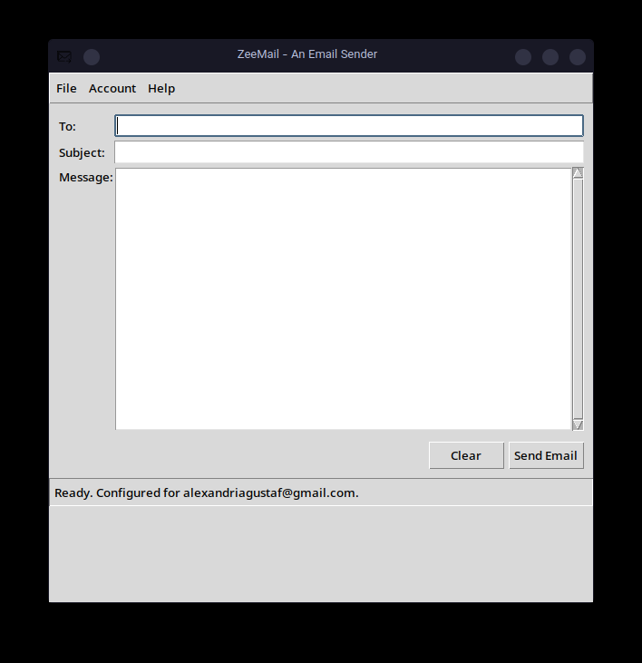

# ZeeMail 📧

> A minimalist, secure, and configurable desktop email sender built with Python and Tkinter.

ZeeMail is a simple desktop application designed for one thing: sending emails quickly and reliably. It securely stores your credentials in your system's native keychain and provides a clean, distraction-free interface. It serves as a great example of a modern, object-oriented Tkinter application.



---

## ✨ Features

*   **Simple & Clean UI**: A straightforward interface with "To", "Subject", and "Message" fields. No clutter.
*   **Secure Credential Storage**: Uses the `keyring` library to safely store your app password in the native OS keychain (macOS Keychain, Windows Credential Manager, Linux Secret Service/KWallet).
*   **Configurable SMTP**: Not just for Gmail! You can configure the SMTP server and port to work with any email provider that supports SMTP over SSL.
*   **Recipient Domain Validation**: Optionally checks if a recipient's email domain has valid MX records before sending, helping to catch typos.
*   **Cross-Platform**: Built with Python and the standard Tkinter library, it runs on Windows, macOS, and Linux.
*   **Clean Architecture**: The code is refactored into an object-oriented structure, separating UI (`EmailApp`), configuration (`ConfigManager`), and email logic (`EmailSender`) for better maintainability.

## 🔧 Requirements

*   **Python 3.8+**
*   **pip** (Python's package installer)
*   **A configured system keyring backend**:
    *   **Windows**: The Credential Manager is built-in.
    *   **macOS**: The Keychain is built-in.
    *   **Linux**: You need to have `secret-service` or `kwallet` installed. For example, on Debian/Ubuntu: `sudo apt-get install libsecret-1-0 gir1.2-secret-1`. Arch users may need to install additional packages (see installation notes below).

## 🚀 Installation & Setup

Follow these steps to get ZeeMail running on your local machine.

**1. Clone the repository:**
```bash
git clone https://github.com/alexantSWE/zeemail.git
cd zeemail
```

**2. Create and activate a virtual environment (recommended):**
This isolates the project's dependencies from your system's Python packages, which is the safest approach.
*   On macOS/Linux:
    ```bash
    python3 -m venv venv
    source venv/bin/activate
    ```
*   On Windows:
    ```bash
    python -m venv venv
    .\venv\Scripts\activate
    ```

**3. Install the dependencies:**
Create a file named `requirements.txt` in the project directory with the following content:
```
keyring
dnspython
```
Then, run the installation command:
```bash
pip install -r requirements.txt
```

<details>
<summary><b>A Note for Arch Linux Users</b></summary>

While it's common to use `pacman` to install Python packages system-wide (e.g., `sudo pacman -S python-keyring`), this project **strongly recommends using a virtual environment** as described above. This prevents any potential conflicts with system packages and ensures the application runs with the exact dependency versions it was tested with.

To follow the virtual environment setup, you may first need to install the necessary tools using `pacman`:

```bash
# Install pip and the venv module
sudo pacman -S python-pip python-venv

# Install the backend for the keyring library
sudo pacman -S libsecret
```

Once these are installed, you can proceed with creating the virtual environment (`python -m venv venv`) and installing the requirements with `pip` as described in the main instructions. **`pip` is the correct tool to use *inside* an activated virtual environment.**

</details>

**4. Run the Application:**
```bash
python main.py
```

**5. First-Time Configuration:**
When you first launch the app, you need to configure your email account.
*   Go to the `Account > Configure...` menu.
*   Enter your **email address**.
*   Enter your **App Password**.
    > **Important for Gmail Users**: You cannot use your regular Google password. You must generate an "App Password".
    > 1. Go to your Google Account > Security.
    > 2. Ensure 2-Step Verification is **ON**.
    > 3. Go to "App passwords".
    > 4. Select app: "Mail", Select device: "Other (Custom name)".
    > 5. Name it "ZeeMail" and click "Generate".
    > 6. Copy the 16-character password (without spaces) and paste it into the ZeeMail configuration window.
*   Verify the SMTP settings (defaults are for Gmail) and click **Save**.

Your credentials will be saved securely, and you're ready to send emails!

## 🛠️ Project Structure

The project is organized with a clear separation of concerns:

*   `main.py`: The main entry point for the application. It initializes and runs the `EmailApp`.
*   **`EmailApp` Class**: Manages the entire Tkinter GUI, including widget creation, layout, and handling user events (like button clicks).
*   **`ConfigManager` Class**: Handles all logic for loading and saving settings. It reads/writes `app_settings.json` for non-sensitive data and interacts with `keyring` for secure password storage.
*   **`EmailSender` Class**: Contains the logic for connecting to an SMTP server via `smtplib` to send emails and for performing DNS checks with `dnspython`.
*   `logo.gif`: The application icon.
*   `screenshot.png`: The screenshot displayed in this README.
*   `app_settings.json`: Automatically created to store non-sensitive settings like your email address and SMTP server configuration. **(This should be added to `.gitignore`)**.
*   `requirements.txt`: Lists the Python package dependencies for the project.

## 📜 License

This project is licensed under the MIT License. See the [LICENSE](LICENSE) file for details.

---
*Built with ❤️ by Alireza Rezaei*
